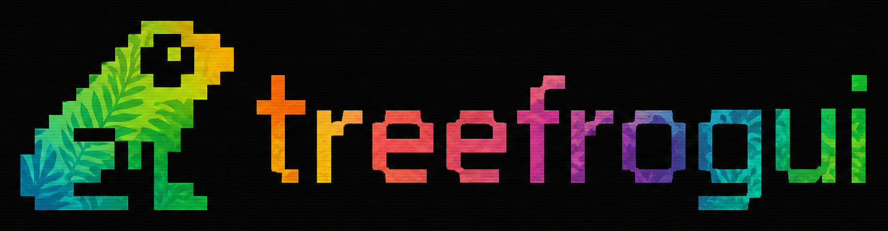
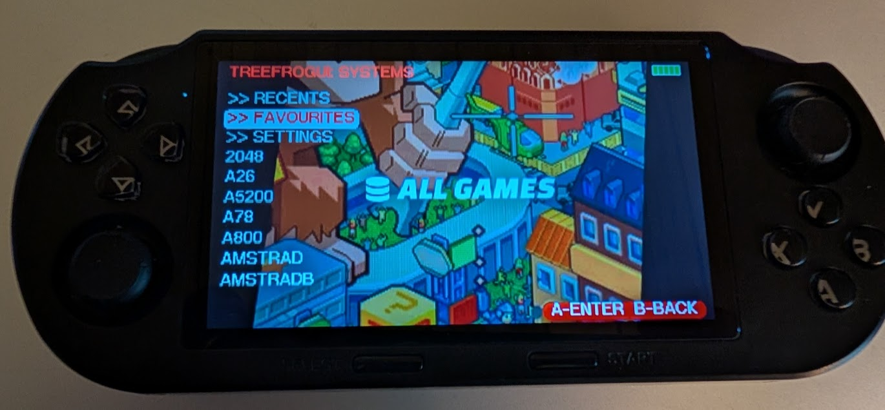

# TreeFrogUI for SF3000

A custom minimal Emulation Frontend for Libretro/Retroarch cores, a heavily modified fork of [FrogUI](https://github.com/tzubertowski/frogui).



> [!NOTE]
> TreeFrogUI is developed by a single developer and is built primarily for the **SF3000** handheld. It **might** also support similar hardware variants such as the **SF3000HD**, **SF3100**, **SF3500**, and **GB350**. Since I currently do not own these devices to test them myself, compatibility is unverified - please try it out and let me know if it works!


📦 **[Installation Guide](install.md)** - Start here to install TreeFrogUI on your device

🎨 **[Theming Guide](theme.md)** - Learn how to customize themes, backgrounds, and fonts

⬇️ **[Latest Release](https://github.com/tzubertowski/treefrog-ui/releases)** - Download the latest version

☕ **[Support the Project](https://www.buymeacoffee.com/tzubertowsg)** - Buy me a coffee!

💬 **[v0.1.0 Feedback Form](https://docs.google.com/forms/d/e/1FAIpQLSfM-y2_UnERrjScqkSfkRSEfBPJ79rDwDo3GwuYWXxpkFTp4Q/viewform?usp=header)** - Submit anonymous feedback or compatibility reports

---

## What's included

| Component | What it does |
|-----------|-------------|
| **TreeFrogUI** (`frogui_libretro.so`) | ROM browser and launcher, runs inside picoarch |
| **57 emulator cores** | NES, SNES, GBA, Mega Drive, PC Engine, Amiga, Atari ST, and more |
| **build system** | Cross-compile everything from source using the SF3000 toolchain |

See [cores.md](cores.md) for the full folder→core mapping table.

---

## Why TreeFrogUI?

- **Minimalistic but powerful UI** - Clean, fast game selection screen with quick navigation.
- **57 emulator cores** - Now supports 57 emulator cores compared to only 14 in the stock OS. This includes standout additions such as **PICO-8** (via Fake08/Retro8), **Quake** (via Tyrquake), **Cave Story** (via NXEngine), **Doom** (via PrBoom), **PlayStation 1** (via PCSX ReArmed), plus classic computer systems like Commodore Amiga and Atari ST.
- **Highly configurable cores** - Configurable settings for all cores, allowing for retro features like console palette swaps, LCD ghosting emulation, and more.
- **In-game saves** - Fully supported across all compatible cores for seamless session saving and loading.
- **Auto-resume on boot** - Automatically boots back into the last played game or frontend view upon device boot.
- **Rich theming options** - Custom background images, fonts, and 30 built-in color themes to fit your style.
- **Proper PCSX4ALL support** - Configurable PlayStation 1 emulator core with native support for `.iso`, `.bin`/`.cue`, and other disc formats.
- **Flexible display scaling** - Easily adjust display scaling modes (Zoom, Aspect Ratio, and Integer Scaling) to suit your preference.

---
## ROM folder setup

Create subfolders inside the `roms/` directory on the root of your SD card matching these names (e.g., `roms/GBA`, `roms/FC`). TreeFrogUI automatically detects the correct emulator based on the folder name. For built-in cores, see the [picoarch submodules/cores](https://github.com/700zx1/picoarch). Below is the full folder-to-core mapping table:

| Folder Name(s) | Target Console / System | Core Shared Library (`.so`) |
|---|---|---|
| **FC**, **nes** | NES / Famicom | `fceumm_libretro.so` |
| **NES**, **nesq** | NES / Famicom (fast) | `quicknes_libretro.so` |
| **nest** | NES / Famicom (accurate) | `nestopia_libretro.so` |
| **SFC**, **snes** | Super Famicom / SNES | `snes9x2005_plus_libretro.so` |
| **snes02** | SNES (accurate / alt) | `snes9x2002_libretro.so` |
| **GBA**, **gba** | Game Boy Advance | `gpsp_libretro.so` |
| **mgba**, **gbaf** | Game Boy Advance (accurate) | `mgba_libretro.so` |
| **gbav** | Game Boy Advance (alt) | `vba_next_libretro.so` |
| **gb**, **dblcherrygb** | Game Boy / Color | `gambatte_libretro.so` |
| **gbgb** | Game Boy (Gearboy) | `gearboy_libretro.so` |
| **gbb** | Game Boy (TGBDual) | `tgbdual_libretro.so` |
| **MD**, **SMS**, **sega** | Mega Drive / Genesis / Master System | `picodrive_libretro.so` |
| **GG**, **gg** | Game Gear | `gearsystem_libretro.so` |
| **gpgx** | Mega Drive (accurate) | `genesis_plus_gx_libretro.so` |
| **PS**, **ps1**, **psx** | PlayStation | `pcsx_rearmed_libretro.so` |
| **pce** | PC Engine / TurboGrafx-16 | `mednafen_pce_fast_libretro.so` |
| **pcesgx** | PC Engine SuperGrafx | `mednafen_supergrafx_libretro.so` |
| **pcfx** | PC-FX | `mednafen_pcfx_libretro.so` |
| **pc8800** | NEC PC-8800 | `quasi88_libretro.so` |
| **ngpc** | Neo Geo Pocket / Color | `race_libretro.so` |
| **geolith** | Neo Geo AES/MVS | `geolith_libretro.so` |
| **wswan** | WonderSwan / Color | `mednafen_wswan_libretro.so` |
| **wsv** | Watara Supervision | `potator_libretro.so` |
| **vb** | Virtual Boy | `mednafen_vb_libretro.so` |
| **a26** | Atari 2600 | `stella2014_libretro.so` |
| **a5200** | Atari 5200 | `a5200_libretro.so` |
| **a78** | Atari 7800 | `prosystem_libretro.so` |
| **a800** | Atari 800 | `atari800_libretro.so` |
| **lnx** | Atari Lynx | `handy_libretro.so` |
| **atari-st** | Atari ST | `castaway_libretro.so` |
| **amiga** | Commodore Amiga | `uae_libretro.so` |
| **c64** | Commodore 64 | `vice_x64_libretro.so` |
| **c64sc** | Commodore 64 (accurate) | `vice_x64sc_libretro.so` |
| **c64f**, **c64fc** | Commodore 64 (Frodo) | `frodo_libretro.so` |
| **vic20** | Commodore VIC-20 | `vice_xvic_libretro.so` |
| **msx** | MSX | `bluemsx_libretro.so` |
| **spec** | ZX Spectrum | `fuse_libretro.so` |
| **zx81** | ZX81 | `81_libretro.so` |
| **col** | ColecoVision | `gearcoleco_libretro.so` |
| **amstrad** | Amstrad CPC | `crocods_libretro.so` |
| **amstradb** | Amstrad CPC (CPC+) | `cap32_libretro.so` |
| **thom** | Thomson MO/TO | `theodore_libretro.so` |
| **xmil** | Sharp X68000 | `x68k_libretro.so` |
| **Quake** | Quake | `tyrquake_libretro.so` |
| **prboom** | Doom / Heretic | `prboom_libretro.so` |
| **wolf3d** | Wolfenstein 3D | `ecwolf_libretro.so` |
| **outrun** | Out Run | `cannonball_libretro.so` |
| **cavestory** | Cave Story | `nxengine_libretro.so` |
| **flashback** | Flashback | `reminiscence_libretro.so` |
| **xrick** | Rick Dangerous | `xrick_libretro.so` |
| **jnb** | Jump 'n Bump | `jumpnbump_libretro.so` |
| **gw** | Game & Watch | `gw_libretro.so` |
| **fake08** | PICO-8 (fake08) | `fake08_libretro.so` |
| **retro8** | PICO-8 (retro8) | `retro8_libretro.so` |
| **lowres-nx** | LowRes NX | `lowresnx_libretro.so` |
| **pokem** | Pokémon Mini | `pokemini_libretro.so` |
| **m2k** | MAME 2000 | `mame2000_libretro.so` |
| **int** | Mattel Intellivision | `freeintv_libretro.so` |
| **fcf** | Fairchild Channel F | `freechaf_libretro.so` |
| **cdg** | CD+G Karaoke | `pocketcdg_libretro.so` |
| **chip8** | CHIP-8 | `jaxe_libretro.so` |
| **arduboy** | Arduboy | `arduous_libretro.so` |
| **vec** | Vectrex | `vecx_libretro.so` |
| **o2em** | Odyssey² / Videopac | `o2em_libretro.so` |
| **gme** | Game Music Emu | `gme_libretro.so` |
| **gong** | Pong clone | `gong_libretro.so` |
| **vapor** | VaporSpec | `vaporspec_libretro.so` |

See [cores.md](cores.md) for detailed build status and source repositories of TreeFrogUI external cores.

---

## Theming

TreeFrogUI supports selectable visual color themes, custom pixel fonts, and per-folder background image loading from the SD card.

📦 **[Theming Guide](theme.md)** - Details on customizing colors, background images, fonts, and editing settings

---

## Shortcuts

While playing a game, use the following button combinations:

- **`SELECT + START`** - Opens the in-game picoarch menu (for all cores *except* PCSX4ALL).
- **`SELECT + L`** - Opens the emulator menu (for PCSX4ALL *only*) or loads a state (slot 0, default) for other cores.
- **`SELECT + R`** - Saves a state (slot 0, default) for all cores *except* PCSX4ALL.

---

## BIOS files required

Some cores need BIOS/firmware files. Place them in the system folder the core expects (check individual core docs), typically alongside the ROMs or in a `bios/` subfolder.

| System | File needed |
|--------|-------------|
| GBA (gpsp) | `gba_bios.bin` (official Nintendo GBA BIOS) |
| Amiga (UAE) | `kick.rom` (Amiga Kickstart ROM) |
| Atari ST (castaway) | TOS ROM image |
| Neo Geo (geolith) | Neo Geo BIOS |
| PC-FX (beetle-pcfx) | `pcfx.rom` |
| PC-88 (quasi88) | NEC PC-88 BIOS files |

---

## Building from source

### Requirements

- SF3000 cross-toolchain at `~/sf3000-work/sf3000toolchain/`
- `git`, `make`, `nproc`

### Steps

```sh
git clone git@github.com:tzubertowski/treefrog-ui.git
cd treefrog-ui

# Clone FrogUI source (submodule)
git submodule update --init frogui

# Clone all emulator core sources
./clone_cores.sh

# Build everything
./build_all.sh

# Results in build/*.so - copy to SD card
cp build/*.so /mnt/sdcard/cubegm/cores/
```

### Build FrogUI only

```sh
cd frogui
make -f Makefile.sf3000 frogui_libretro.so
cp frogui_libretro.so /mnt/sdcard/cubegm/cores/
```

---

## How it works

```
[boot] icube  (/mnt/sdcard/cubegm/icube)
    │
    └─► picoarch frogui_libretro.so    ← TreeFrogUI is a libretro core
              │
              │  user selects ROM
              │
              └─► fork()
                     │
                [parent]            [child]
                waitpid()           picoarch <game_core.so> <rom>
                (blocks)                │
                   │              game runs
                   │              user exits
                   │                  │
                resumes ◄──── child exits
                TreeFrogUI menu
```

**picoarch** handles display (`/dev/dis` + framebuffer), audio (ALSA), and the libretro core lifecycle. TreeFrogUI is just another `.so` loaded by picoarch - it renders the file browser UI and uses `fork+waitpid` to launch games without losing the display connection.

**Input** comes from `cubevol` (SF3000 button daemon) via shared memory at `/tmp/joy_key`. TreeFrogUI reads it directly since picoarch doesn't route input callbacks to cores on this device.

---

## Repository structure

```
treefrog-ui/
├── frogui/          ← FrogUI source (git submodule, sf3000 branch)
├── cores/           ← emulator core sources (populated by clone_cores.sh)
├── build/           ← compiled .so output (gitignored)
├── patches/         ← patches applied to externally-owned core repos at build time
├── build_all.sh     ← build all cores
├── clone_cores.sh   ← clone all core source repos
└── cores.md         ← folder→core mapping reference
```

---

## What's not included / known limitations

| Item | Status |
|------|--------|
| `vecx` (Vectrex) | ❌ needs OpenGL - not available on SF3000 |
| `arduous` (Arduboy) | ❌ needs cmake - not in toolchain |
| `o2em` (Odyssey²) | ❌ not yet cloned |
| `vice` (C64) | commented out - large build, enable manually in build_all.sh |
| `fake-08` (PICO-8) | not yet built |
| picoarch binary | not included - obtain from SF3000 multicore project |

---

## Credits

- **picoarch** - libretro frontend adapted for SF3000
- **FrogUI** - original launcher by tzubertowski, fork of [FrogUI](https://github.com/tzubertowski/FrogUI)
- **angree** - Amiga (UAE4ALL) and Atari ST (castaway) ports for SF-series handhelds
- **goph-R** - [SF3000-RE](https://github.com/goph-R/SF3000-RE) reverse engineering project and boot logo specs
- All libretro core authors

---

## License & Attribution

This project is a compilation of multiple components, each retaining its original license:

- **TreeFrogUI for SF3000 (UI Port)**: Licensed under the **Creative Commons Attribution-NonCommercial-ShareAlike 4.0 International (CC BY-NC-SA 4.0)** license. It is a heavily modified fork of [FrogUI](https://github.com/tzubertowski/frogui), created by Tomasz Zubertowski, Desoxyn, and Q_ta.
 - *Attribution*: Changes have been made to support the SF3000 hardware architecture, resolution, input handling, and directory layout.
 - *ShareAlike*: Any modifications or derivations of the UI frontend code must be distributed under the same CC BY-NC-SA 4.0 license.
 - *NonCommercial*: This software is strictly for non-commercial use. Selling or bundling it with commercial devices is prohibited.
  - *Assets & Images*: The logo and font were taken from the upstream [FrogUI](https://github.com/tzubertowski/frogui) repository, while the default system background images were sourced from the **[Art Book Next](https://github.com/anthonycaccese/art-book-next-es)** ES-DE theme by Anthony Caccese. These assets are used under their respective open-source and creative commons licenses.
- **picoarch (Frontend Integration)**: Uses code from `libpicofe` (triple-licensed under GNU GPL v2+, GNU LGPL v2.1+, or the MAME license) and neonloop's wrapper code (licensed under the **BSD 3-Clause License**).
- **Emulator Cores**: Each emulator core located in the `cores/` directory is built from its respective upstream repository and retains its individual open-source license (such as GPL, BSD, MIT, or MAME license). See [cores.md](cores.md) and individual core subdirectories for details.

See the root [LICENSE.md](LICENSE.md) file for the full copyright notices and license texts.
