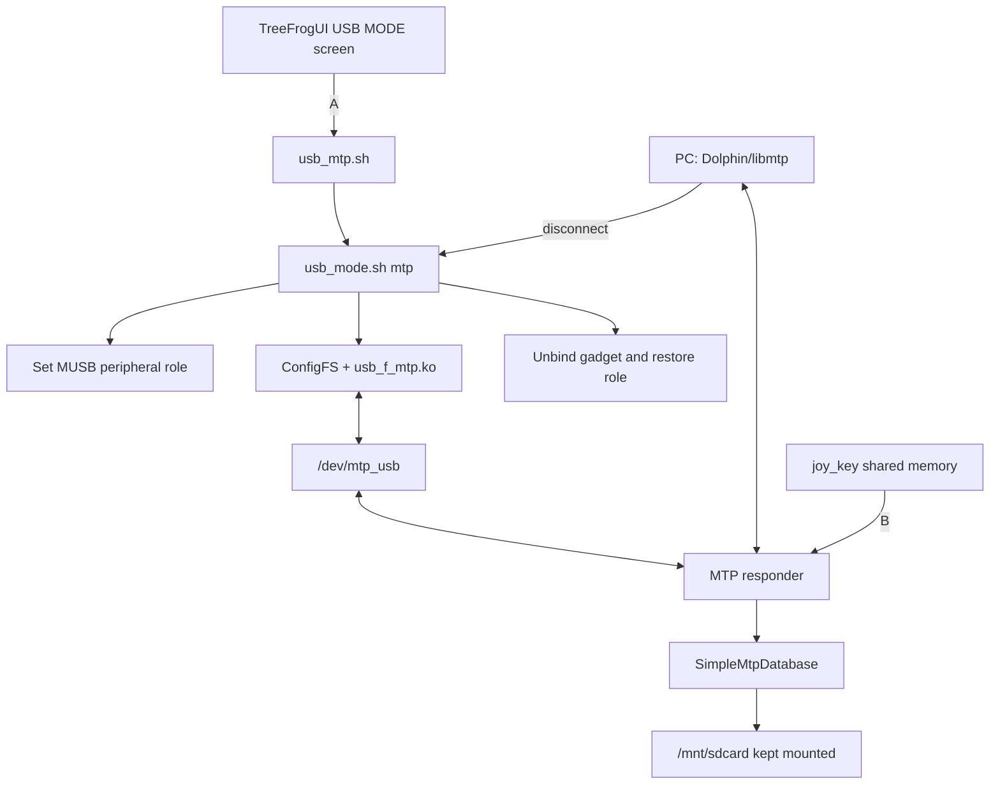

# TreeFrogUI MTP: how it works



## What runs

1. FrogUI shows a separate USB MODE page. A starts it; B cancels/exits.
2. The launcher re-execs from `/tmp`, so its working directory and file
   descriptors do not keep the SD card busy.
3. `usb_mode.sh mtp` keeps `/mnt/sdcard` mounted, switches the MUSB controller
   to peripheral mode, loads the recovered vendor `usb_f_mtp.ko`, and creates a
   one-function ConfigFS gadget.
4. The standalone MIPS responder opens `/dev/mtp_usb`, indexes the SD tree, and
   serves MTP requests to the PC.

## How read/write works

MTP does not export the SD block device. The PC asks for object handles and
metadata, then transfers individual files through the responder.

```text
SendObjectInfo → beginSendObject() → destination path is created
SendObject     → payload is written
endSendObject  → entry is kept on success or removed on failure
```

Parent handle `0` maps to the SD root for host uploads. The database has a
special `getObjectFilePath(0)` case returning `/mnt/sdcard`; this is required by
clients that send `SendObjectInfo` with parent `0`. The responder remains the
only writer, so the PC never mounts the FAT filesystem concurrently.

## Exit and safety

- B requests exit through `/tmp/treefrog_mtp_exit`; cleanup unbinds the gadget
  and restores the original USB role.
- A host disconnect is observed through the UDC state. Cleanup waits for a real
  detached state before tearing down the gadget.
- Only one MTP client should own the interface. Dolphin/KIO, GVFS, and
  `mtp-tools` can otherwise contend for the same libusb handle.
- Users should close/eject the device before unplugging. MTP is safer than raw
  mass storage here, but an interrupted transfer can still leave a partial
  file.

## Standards and known caveats

- `0xFFFFFFFF` requests objects directly under the storage root; `0` requests
  all objects, matching Android/libmtp semantics.
- ObjectInfo and property descriptors cover the fields used by KDE/libmtp.
- Optional operations such as move, thumbnails, and full property-list writes
  are not implemented yet.
- The gadget uses a libmtp-known Android-compatible VID/PID so KDE's `kmtpd`
  initializes the session; USB strings still identify TreeFrogUI.
- The MTP kernel function is a recovered 4.4.186 MIPS module from the stock
  image, not a newly built kernel component.

## Refactor/test backlog

- Expand compact database methods into ordinary multi-line C++ with explicit
  error handling.
- Harden uploaded names against absolute paths, `..`, and embedded separators.
- Implement `GetObjectPropList` or advertise a narrower optional operation set.
- Return real MTP date-time strings from `stat()` timestamps.
- Add automated host tests: upload root/subdirectory files, verify bytes, delete,
  and verify the database after reconnect.

## External USB storage follow-up

Using a flash drive as a console-side USB host is separate work. First verify
MUSB host mode, VBUS power, USB mass-storage/SCSI/FAT drivers, and hotplug with
a powered OTG hub. Then mount the drive safely and add it as another FrogUI ROM
root. The stock image currently documents only the internal `/dev/root` ext2
filesystem and the normal VFAT SD; no separate ext2 games slot is present.
